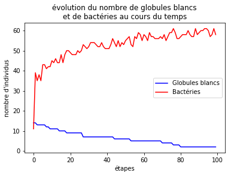

## Compte rendu de la semaine 2 ##

Bonjour bonjour, déjà 7 jours que notre projet est lancé.

Pour débuter quoi de mieux qu'une belle citation :
> "Quel est le rêve de toute cellule, devenir deux cellules". François Jacob
  
Plus concrétement, nous avons continué le travail avec pour objectif d'avancer dans l'écriture du code et dans nos recherches sur la petite vie des bactéries. Ainsi nous avons déterminé les "Règles de la modélisation" sur la page d'accueil, et codé ces mêmes règles dans une nouvelle fonction sur notre programme avec une importante quantité de **conditions** et de **paramètres** pour un fonctionnement optimal.  
  Voici un extrait de la fonction : 
``` 
if (c == 1): #Bactérie
        if(globules >= nb_gb_necessaires): #Les GB tuent la bactéries
            return 0
        elif(bacteries >= nb_b_surpop): #La bactérie meurt (surpopulation)
            return 0
        else: #La bactérie survie
            return 1
```
  
Lors de la création de cette fonction, suite à une erreur *"list out of the range"*, nous avons décidé de mettre de coté l'option "infini" pour y revenir plus tard.
  
Nous pouvons maintenant optenir à partir d'une matrice initiale, la matrice à l'état suivant. Et le tout grace à un super bouton *Next step*, une magnifique trouvaille de Alexandre.
  
Le projet avance à une vitesse hallucinante, on est déjà en mesure d'afficher notre matrice après un nombre (variable : *steps*) d'étapes et d'afficher un tableau qui renvoie le nombre de globules blancs et de bactéries après *steps* étapes.
  
Un exemple de simulation :


Alma.
